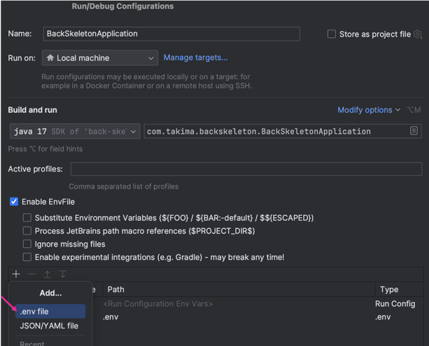

# Lancement du projet

## Set up 
1. Copier-coller le .env.sample en .env
2. Lancer Docker et faire un `docker-compose up
3. Rajouter le plugin : https://plugins.jetbrains.com/plugin/7861-envfile
4. 
5. 
6. 
7. Exécuter les scripts BDD dans /initdb
8. Run la BackSkeletonApplication

Tout est bon !
